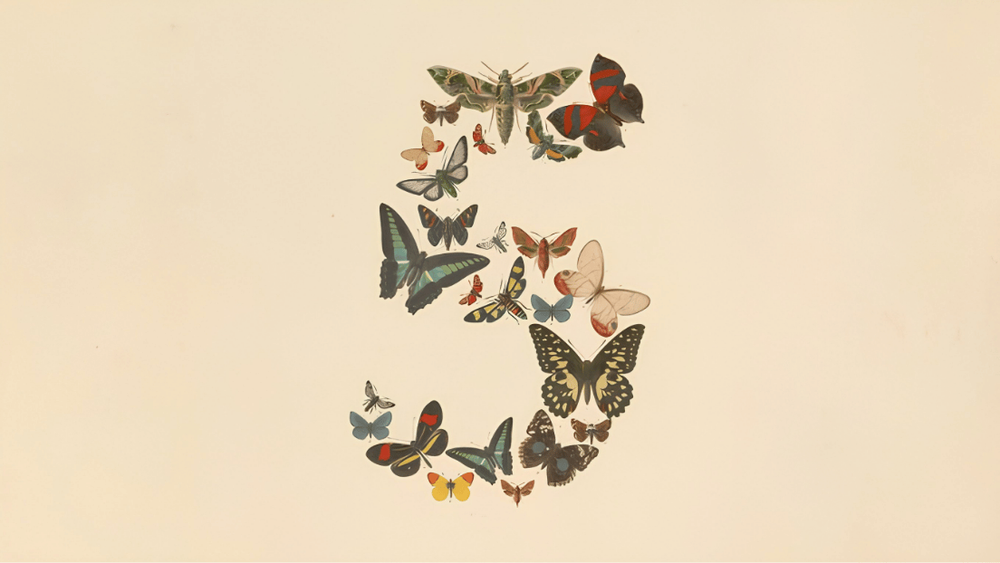

# Claude Fable 5 — Native Desktop Client for Anthropic's Mythos-Class Model

**Fable 5 is Anthropic's newest and most capable generally-available model — the first in the Claude 5 family, built on the advanced Mythos-class architecture that sits above Claude Opus.** This repository provides a native desktop client that brings the model's raw computational power out of the web sandbox and directly into your operating system. Optimized for long-horizon tasks, Fable 5 outperforms Claude Opus by 11.2% in complex coding benchmarks and unlocks unprecedented capabilities for deep local infrastructure auditing and cybersecurity. Your projects, prompts, and session history are stored locally on your machine. Free to use through June 22, 2026. One-click signed installer, zero telemetry.

  

---

## 🏗 The Mythos Architecture & Desktop Capabilities

Fable 5 is designed to execute highly complex tasks where standard LLMs lose context or logical coherence over medium distances. Moving the interaction core into a native application (EXE/DMG) bypasses browser container limits, deploying a full-fledged local suite for analysis and development.

### Core Technological Advancements:
* **Infrastructure Audit & Cybersecurity:** Unlike web versions, the desktop client allows you to drag-and-drop system logs, network configurations, active port lists, and compiled binaries directly into the model. Fable 5 excels at identifying zero-day vulnerabilities, analyzing distributed system logic, checking cryptographic implementations (e.g., validating BIP-39 mnemonic generation to ensure strict adherence to valid wordlists like "rhythm" over common typos), and auditing smart contracts without risking source code leaks to public databases.
* **11.2% Coding Performance Leap:** The model can hold up to 500 pages of documentation or a massive repository's codebase in its active memory simultaneously. This enables cross-file refactoring across interdependent modules and microservices with zero hallucination.
* **Ultra-Deep Context for Multi-Week Sessions:** Run a single project within a continuous thread for weeks. The model retains architectural decisions, security requirements, and intermediate fixes agreed upon hundreds of messages ago.
* **Isolated Local Storage:** Your workspace structures, query history, and file indexes are never sent to third-party servers for analytics. All API requests are routed directly to Anthropic's secure endpoints.

---

## 🎯 What Fable 5 is Best At

* **Proactive Software & System Security:** Rapid analysis of dependency trees, Docker manifests, and network configurations. The model localizes logical errors, outdated libraries, and OS misconfigurations, providing ready-to-use hardening instructions.
* **Whole-Codebase Engineering:** Analyzing legacy code, automatically generating unit test coverage, and rewriting architectures for high-load tasks.
* **Heavy Document Synthesis:** Working with massive technical specifications, legal contracts, and security standards, offering instant section comparisons and structure extraction.
* **Multi-Step Logical Research:** Designing complex systems, synthesizing data from disparate local sources, and verifying logical chains.

---

## 📊 Comparison: Desktop Client vs. Cloud Alternatives

| Feature | Fable 5 (This Client) | Claude Web App | Claude Opus (Web) | ChatGPT (GPT-5.5) |
| :--- | :--- | :--- | :--- | :--- |
| **Base Model** | **Fable 5 (Mythos-class)** | Fable 5 | Opus Tier | GPT-5.5 |
| **Coding Efficiency** | 🚀 **Top Tier (+11.2% vs Opus)** | Top Tier | Baseline | High |
| **Local File Auditing** | ✅ **Yes (Direct OS access)** | No (Upload only) | No | Partial |
| **InfoSec / Log Scans** | ✅ **Unrestricted Local Input** | Sandboxed | Sandboxed | Sandboxed |
| **Local Project Library**| ✅ **Yes (100% Local)** | No | No | No |
| **Launch Free Tier** | **Through June 22** | Subscription | Subscription | Subscription |
| **Client Telemetry** | ❌ **Zero (Open Source)** | Present | Present | Present |

---

## 🛠 System Modules

1.  **Infrastructure Security Scanner:** A drag-and-drop interface for safely feeding configuration files and logs to rapidly identify attack vectors and vulnerabilities.
2.  **Whole-Codebase Architect:** A dedicated module for indexing local project folders, allowing Fable 5 to apply changes across multiple files simultaneously.
3.  **Local Project Vault:** A local history management system supporting full-text search across all past sessions and categorization by Workspaces.
4.  **Secure Network Bridge:** A direct API gateway eliminating any intermediary data compression or analytics servers.

---

## 📥 Install & Setup

Builds are compiled and signed with official developer certificates to prevent false positives from security systems.

* 📥 [**Download Fable-5-x64.7z**](../../releases) (Windows 10/11 64-bit) — Fully SmartScreen compatible.
* 📥 [**Download Fable-5.dmg**](../../releases) (macOS Universal) — Apple Developer ID signed and notarized. Supports Apple Silicon (M1–M5) and Intel.

*First run:* Sign in with your Claude account. Access to Fable 5 is activated instantly and is valid through June 22, 2026, with no credit card required.

---

## ❓ FAQ

**Is this an official Anthropic app?**
No. This is an independent third-party desktop client operating directly with the official Fable 5 model. Anthropic's original interfaces remain the web version and API. This client is built for professionals who require deep OS integration and local data storage.

**Why is this client safer for InfoSec audits and coding than a browser?**
Browser tabs are isolated and cannot efficiently handle heavy local folders, binaries, or log dumps due to memory limits. The native app optimizes parsing locally on your PC and transmits strictly sanitized text structures to the model, preventing accidental synchronization of sensitive configurations with cloud analytics trackers.

**Is it really free?**
Yes, full access to Fable 5's potential through this client is free during the launch period until June 22, 2026. After this date, usage terms will be updated. The client itself will remain free and open-source, and you will be able to use your standard Claude subscription for model access.

**What makes Fable 5 different from Claude Opus?**
Fable 5 is based on the next-generation Mythos architecture. It is 11.2% more efficient at writing and refactoring code and features advanced long-term planning mechanisms, allowing it to sustain long sessions without losing context.

**How is privacy ensured?**
The project is distributed under the MIT license, and the entire codebase is open for audit. The application contains absolutely no built-in telemetry or hidden trackers. Your prompt history is encrypted and stored exclusively on your local drive.

---

## 🗺 Roadmap

* **v1.1** — Linux packages (.deb, .rpm, AppImage). Cross-workspace search integration.
* **v1.2** — Local encrypted vault for private keys and sessions. Background monitoring hooks for local infrastructure logs.
* **v2.0** — Team workspaces with secure project library synchronization in private networks.

## License & Disclaimer
MIT License. See [LICENSE](LICENSE).
This is an independent third-party desktop client for Fable 5. Conversations are processed by Fable 5 under Anthropic's standard privacy policies. This client adds no intermediary server and collects no telemetry.
